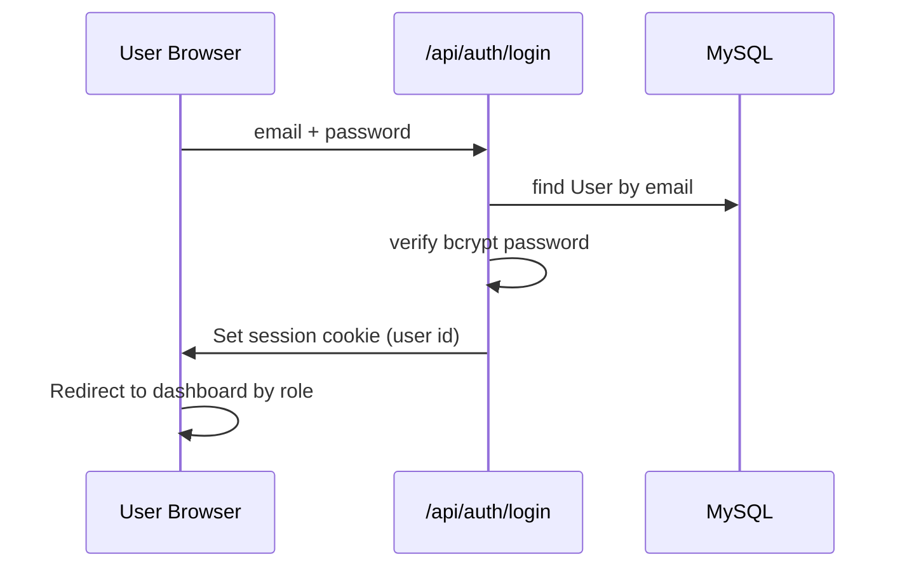
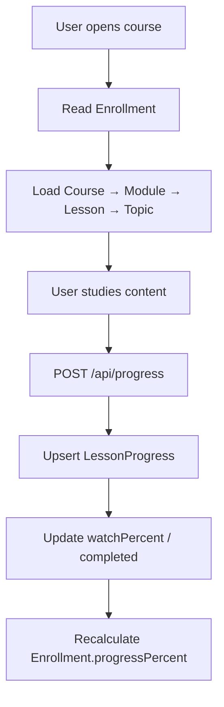
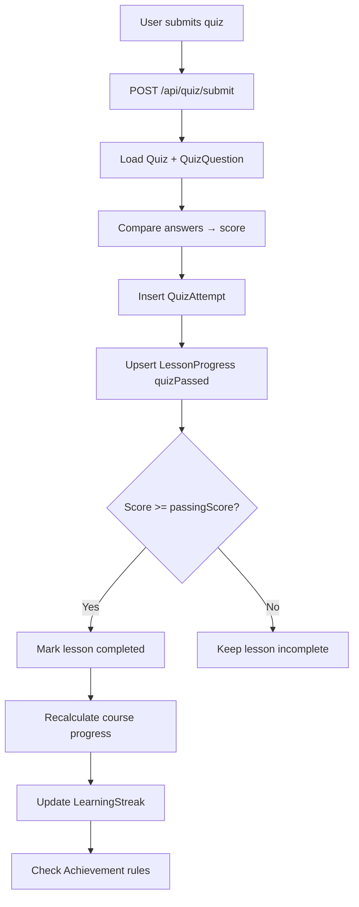
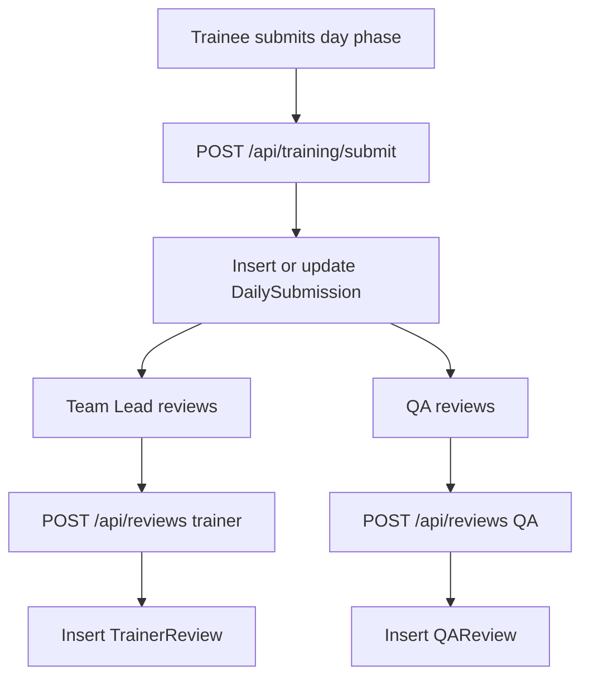
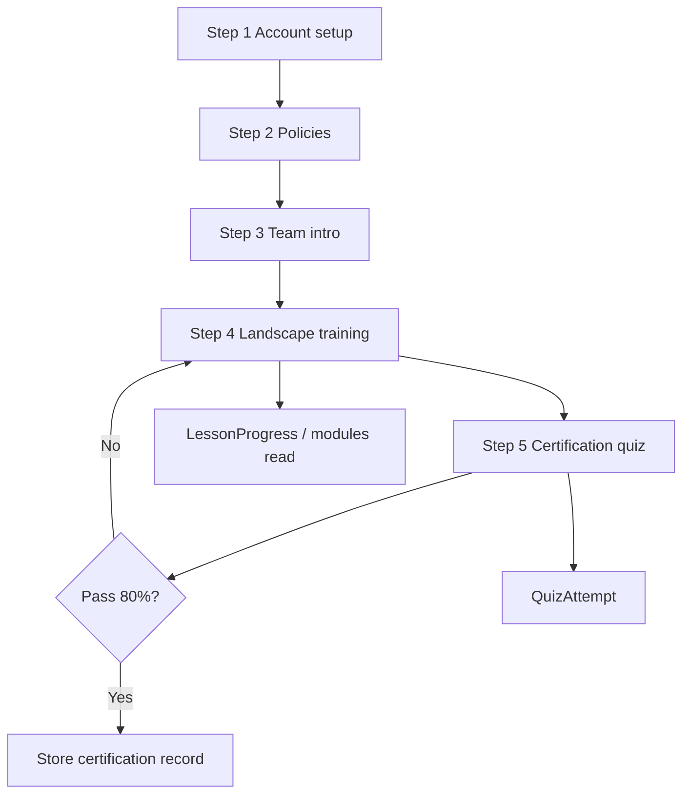

# TMS — Data Flow Documentation

How data moves through the system (read/write paths).  
**Related:** [DATABASE-DESIGN.md](./DATABASE-DESIGN.md) §6 · [DIAGRAMS.md](./DIAGRAMS.md)

**Export diagrams:** Copy Mermaid blocks → [mermaid.live](https://mermaid.live) → PNG.

---

## 1. Login & session



**Tables:** `User`  
**Reads:** email, passwordHash, role  
**Writes:** session cookie only (no DB write on login)

---

## 2. Course learning & progress



**Tables:** `Enrollment`, `LessonProgress`, `Lesson`, `Topic`  
**Key fields:** `watchPercent`, `completed`, `progressPercent`, `lastLessonId`

---

## 3. Quiz submit & course completion



**Tables:** `QuizAttempt`, `LessonProgress`, `Enrollment`, `LearningStreak`, `UserAchievement`  
**Key fields:** `score`, `passed`, `answers` (JSON)

---

## 4. Daily training submission & reviews



**Tables:** `DailySubmission`, `TrainerReview`, `QAReview`, `TrainingDay`, `TrainingPhaseConfig`  
**Unique:** one row per `userId` + `dayNumber` + `phase`

---

## 5. Admin content management

```mermaid
flowchart LR
    A[Admin] --> B[/admin/content]
    B --> C[CRUD Course Module Lesson]
    C --> D[API /api/courses modules lessons topics]
    D --> E[(MySQL)]
    B --> F[QuizQuestionManager]
    F --> G[/api/quiz/questions]
    G --> E
```

**Tables:** `Course`, `Module`, `Lesson`, `Topic`, `Quiz`, `QuizQuestion`

---

## 6. Onboarding flow (planned — UI partly static today)

*Target flow when fully integrated with database.*



**Today:** steps 1–5 shown from `onboarding-data.ts`; quiz not always saved to DB.  
**Planned tables:** onboarding step progress (see DATABASE-DESIGN §8).

---

## 7. Reporting data sources

| Report need | Query from |
|-------------|------------|
| Who completed a course | `Enrollment.status`, `completedAt` |
| Lesson-level detail | `LessonProgress` |
| Quiz results | `QuizAttempt` |
| Daily productivity/quality | `DailySubmission` |
| Review pending | `TrainerReview.status`, `QAReview.status` |
| Trainee assignment | `TraineeProfile` + `User` |

---

## Document map

| Section | Topic |
|---------|--------|
| §1 | Login |
| §2 | Learning progress |
| §3 | Quiz |
| §4 | Daily training + reviews |
| §5 | Admin content |
| §6 | Onboarding (planned integration) |
| §7 | Reporting |

*Update this file when a new API or flow is added. Log changes in [DEVELOPMENT-LOG.md](./DEVELOPMENT-LOG.md).*
