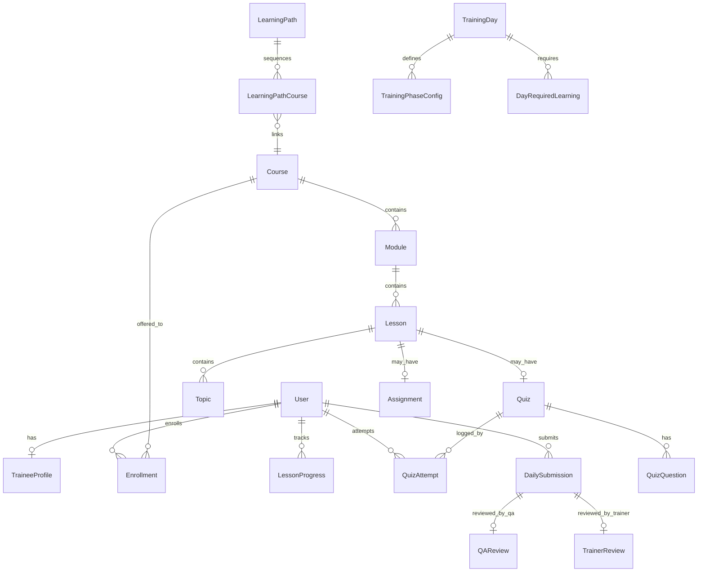
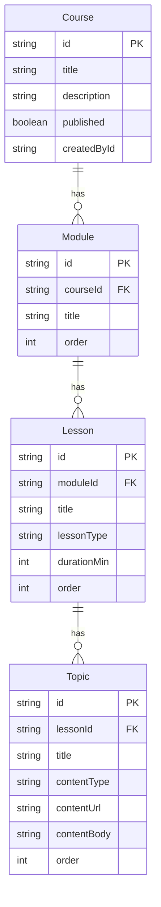
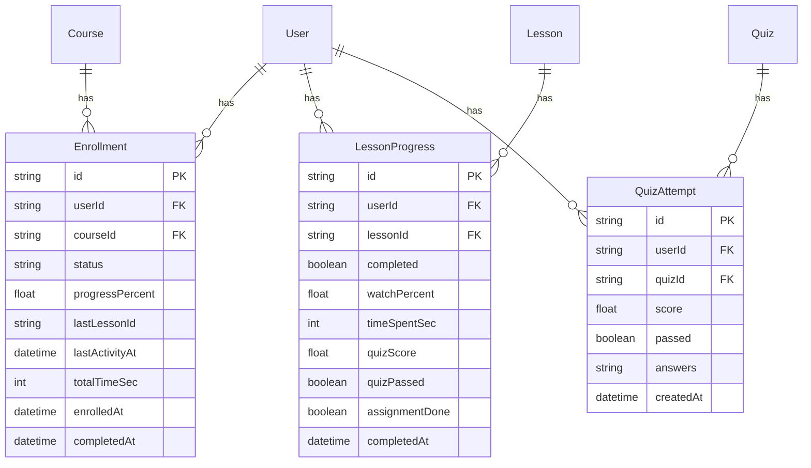

# TMS Training Hub — Database Design & Entity Relationship Document

**Product:** Training Management System (TMS) / Employee Onboarding Platform  
**Database:** MySQL  
**ORM:** Prisma  
**Version:** 1.0  
**Date:** June 2026  

---

## 1. Executive summary

This document describes the database architecture for the **TMS Training Hub**, an internal platform used to onboard employees, deliver project training (e.g. Landscape annotation), run certification quizzes, and give Team Leads and Admins visibility into progress and daily work quality.

The design supports:

- **Three user roles:** Employee (Trainee), Team Lead (Trainer), Admin  
- **Structured learning:** Courses → Modules → Lessons → Topics  
- **Assessments:** Quizzes with auto-grading and attempt history  
- **15-day operational training:** Daily phases, submissions, QA and Trainer reviews  
- **Engagement:** Learning paths, achievements, streaks, notes, discussions  

**Total entities:** 27 tables (Prisma models)  
**Source of truth:** `prisma/schema.prisma`

---

## 2. High-level domain map

| Domain | Purpose | Core entities |
|--------|---------|---------------|
| **Identity & access** | Login, roles, employee profiles | `User`, `TraineeProfile` |
| **Content catalog** | Training material structure | `Course`, `Module`, `Lesson`, `Topic` |
| **Assessment** | Quizzes and practical assignments | `Quiz`, `QuizQuestion`, `Assignment` |
| **Learning rules** | Prerequisites and completion criteria | `Prerequisite`, `CompletionRule`, `LearningPath` |
| **Learner progress** | Who learned what, how far | `Enrollment`, `LessonProgress`, `QuizAttempt` |
| **Engagement** | Motivation and collaboration | `Achievement`, `LearningStreak`, `LessonNote`, `DiscussionComment` |
| **Field training** | Day-wise project work and reviews | `TrainingDay`, `DailySubmission`, `QAReview`, `TrainerReview` |

---

## 3. Entity relationship diagrams

### 3.1 Overview (all domains)



### 3.2 Users, roles & trainee assignment

```mermaid
erDiagram
    User {
        string id PK
        string email UK
        string passwordHash
        string name
        string employeeId UK
        string role
        datetime dateOfJoining
        datetime createdAt
        datetime updatedAt
    }

    TraineeProfile {
        string id PK
        string userId UK FK
        string projectAssigned
        string trainerId FK
        string qaId FK
        boolean trainingStarted
        string trainingStatus
        boolean readyForProduction
        int currentDayNumber
    }

    User ||--o| TraineeProfile : "1:1 trainee"
    User ||--o{ TraineeProfile : "trainer assignments"
    User ||--o{ TraineeProfile : "QA assignments"
```

**Role values (application):** `TRAINEE`, `TRAINER`, `ADMIN`  

**Trainee status examples:** `REGISTERED`, `IN_PROGRESS`, etc.

### 3.3 Learning content hierarchy



**Lesson types:** `CONTENT`, `QUIZ`, `ASSIGNMENT`  

**Topic content types:** `VIDEO`, `PDF`, `SOP`, `PPRT`, `DOCUMENT`, etc.

### 3.4 Quizzes, assignments & completion rules

```mermaid
erDiagram
    Quiz {
        string id PK
        string lessonId UK FK
        string title
        int passingScore
    }

    QuizQuestion {
        string id PK
        string quizId FK
        string question
        string options
        string correct
        int order
    }

    Assignment {
        string id PK
        string lessonId UK FK
        string title
        string instructions
    }

    CompletionRule {
        string id PK
        string courseId FK
        boolean requireAllLessons
        boolean requireQuizPass
        int minWatchPercent
    }

    Prerequisite {
        string id PK
        string courseId FK
        string prereqCourseId FK
    }

    Lesson ||--o| Quiz : has
    Quiz ||--o{ QuizQuestion : has
    Lesson ||--o| Assignment : has
    Course ||--o{ CompletionRule : has
    Course ||--o{ Prerequisite : "requires"
```

### 3.5 Progress, enrollment & quiz attempts



**Unique constraints:**  
- One enrollment per user per course (`userId` + `courseId`)  
- One progress row per user per lesson (`userId` + `lessonId`)

### 3.6 Learning paths & achievements

```mermaid
erDiagram
    LearningPath {
        string id PK
        string title
        boolean published
    }

    LearningPathCourse {
        string id PK
        string pathId FK
        string courseId FK
        int order
    }

    Achievement {
        string id PK
        string code UK
        string title
        string description
    }

    UserAchievement {
        string id PK
        string userId FK
        string achievementId FK
        datetime earnedAt
    }

    LearningStreak {
        string id PK
        string userId UK FK
        int currentStreak
        int longestStreak
        datetime lastLearnDate
    }

    LearningPath ||--o{ LearningPathCourse : contains
    LearningPathCourse }o--|| Course : references
    User ||--o{ UserAchievement : earns
    Achievement ||--o{ UserAchievement : awarded
    User ||--o| LearningStreak : has
```

### 3.7 Fifteen-day training & daily reviews

```mermaid
erDiagram
    TrainingDay {
        int id PK
        string title
        string projectName
        string description
    }

    TrainingPhaseConfig {
        string id PK
        int dayId FK
        string phase
        int productivityTarget
        int qualityTarget
        string qcDeadline
    }

    DayRequiredLearning {
        string id PK
        int dayId FK
        string courseId FK
        string lessonId FK
        string label
        boolean required
    }

    DailySubmission {
        string id PK
        string userId FK
        int dayNumber
        string phase
        boolean sopRead
        int tasksCompleted
        float productivityPct
        float qualityPct
        string issues
        boolean learningComplete
        datetime submittedAt
    }

    QAReview {
        string id PK
        string submissionId UK FK
        string reviewerId FK
        string feedback
        int errorCount
        float qualityScore
        string status
    }

    TrainerReview {
        string id PK
        string submissionId UK FK
        string reviewerId FK
        string remarks
        string status
    }

    TrainingDay ||--o{ TrainingPhaseConfig : has
    TrainingDay ||--o{ DayRequiredLearning : requires
    User ||--o{ DailySubmission : submits
    DailySubmission ||--o| QAReview : has
    DailySubmission ||--o| TrainerReview : has
```

**Phase examples:** `QUALITY_FOCUS`, `QUALITY_PRODUCTIVITY`, `PRODUCTION_SIMULATION`  

**Unique constraint:** One submission per user per day per phase (`userId` + `dayNumber` + `phase`)

---

## 4. Entity dictionary

### 4.1 Identity & access

| Entity | Description | Key fields |
|--------|-------------|------------|
| **User** | All platform accounts (employee, team lead, admin) | `email`, `role`, `passwordHash`, `employeeId` |
| **TraineeProfile** | Extended data for employees in training | `projectAssigned`, `trainerId`, `qaId`, `trainingStatus`, `currentDayNumber` |

### 4.2 Content catalog

| Entity | Description | Key fields |
|--------|-------------|------------|
| **Course** | Training program (e.g. Orientation, REX, Landscape) | `title`, `published` |
| **Module** | Section within a course | `courseId`, `order` |
| **Lesson** | Single learning unit | `lessonType`, `durationMin` |
| **Topic** | Actual content piece (video, PDF, SOP text) | `contentType`, `contentUrl`, `contentBody` |

### 4.3 Assessment

| Entity | Description | Key fields |
|--------|-------------|------------|
| **Quiz** | Assessment attached to one lesson | `passingScore` (e.g. 70 or 80) |
| **QuizQuestion** | Multiple-choice question | `options` (JSON string), `correct` |
| **Assignment** | Practical exercise | `instructions` |
| **AssignmentSubmission** | Trainee submission for an assignment | `content`, `submittedAt` |

### 4.4 Rules & paths

| Entity | Description | Key fields |
|--------|-------------|------------|
| **Prerequisite** | Course A requires Course B first | `courseId`, `prereqCourseId` |
| **CompletionRule** | How to mark a course complete | `requireAllLessons`, `requireQuizPass`, `minWatchPercent` |
| **LearningPath** | Ordered journey (e.g. 15-day onboarding) | `title`, `published` |
| **LearningPathCourse** | Course order inside a path | `pathId`, `courseId`, `order` |

### 4.5 Progress & tracking

| Entity | Description | Key fields |
|--------|-------------|------------|
| **Enrollment** | User registered in a course | `status`, `progressPercent`, `completedAt` |
| **LessonProgress** | Per-lesson completion | `watchPercent`, `quizPassed`, `completed` |
| **QuizAttempt** | History of quiz tries | `score`, `passed`, `answers` (JSON) |

### 4.6 Engagement

| Entity | Description | Key fields |
|--------|-------------|------------|
| **Achievement** | Badge definition | `code`, `title`, `milestone` |
| **UserAchievement** | Badge earned by user | `earnedAt` |
| **LearningStreak** | Consecutive learning days | `currentStreak`, `longestStreak` |
| **LessonNote** | Private notes per lesson | `content` |
| **DiscussionComment** | Comments on a lesson | `content`, `createdAt` |

### 4.7 Field training (15-day plan)

| Entity | Description | Key fields |
|--------|-------------|------------|
| **TrainingDay** | Calendar day 1–15 with project focus | `projectName`, `title` |
| **TrainingPhaseConfig** | Targets per phase for that day | `productivityTarget`, `qualityTarget`, `qcDeadline` |
| **DayRequiredLearning** | Lessons/courses required that day | `courseId`, `lessonId`, `label` |
| **DailySubmission** | Trainee end-of-phase report | `productivityPct`, `qualityPct`, `sopRead` |
| **QAReview** | Quality reviewer feedback | `errorCount`, `qualityScore`, `status` |
| **TrainerReview** | Team lead remarks | `remarks`, `status` |

---

## 5. Relationship summary

| Parent | Child | Cardinality | On delete |
|--------|-------|-------------|-----------|
| User | TraineeProfile | 1 : 0..1 | Cascade |
| User | Enrollment | 1 : many | Cascade |
| User | LessonProgress | 1 : many | Cascade |
| User | QuizAttempt | 1 : many | Cascade |
| User | DailySubmission | 1 : many | Cascade |
| Course | Module | 1 : many | Cascade |
| Module | Lesson | 1 : many | Cascade |
| Lesson | Topic | 1 : many | Cascade |
| Lesson | Quiz | 1 : 0..1 | Cascade |
| Lesson | Assignment | 1 : 0..1 | Cascade |
| Quiz | QuizQuestion | 1 : many | Cascade |
| Course | Enrollment | 1 : many | Cascade |
| TrainingDay | TrainingPhaseConfig | 1 : many | Cascade |
| DailySubmission | QAReview | 1 : 0..1 | Cascade |
| DailySubmission | TrainerReview | 1 : 0..1 | Cascade |
| User (Trainer) | TraineeProfile | 1 : many | — |
| User (QA) | TraineeProfile | 1 : many | — |

---

## 6. Data flow (business logic)

> **Full data flow doc with diagrams:** [DATA-FLOW.md](./DATA-FLOW.md)

### 6.1 Employee completes a course lesson

```
User → Enrollment (course) → LessonProgress (per lesson)
                              ↓
                    Topic content consumed (watch %)
                              ↓
                    Quiz → QuizAttempt → LessonProgress.quizPassed
                              ↓
                    Enrollment.progressPercent recalculated
```

### 6.2 Employee completes a training day (field work)

```
TraineeProfile.currentDayNumber
        ↓
TrainingDay + DayRequiredLearning (what to study)
        ↓
DailySubmission (per phase: morning / afternoon / simulation)
        ↓
QAReview + TrainerReview (supervisor sign-off)
```

### 6.3 Admin / Team Lead reporting (supported by schema)

- **Who is enrolled in which course** → `Enrollment` + `User`  
- **Quiz pass rates** → `QuizAttempt`  
- **Lesson completion** → `LessonProgress`  
- **Daily productivity/quality** → `DailySubmission`  
- **Reviewer status** → `QAReview`, `TrainerReview`  

---

## 7. Sample content (seed data)

After running `npm run db:seed`, the database includes:

| Item | Examples |
|------|----------|
| Users | `admin@company.in`, `lead@company.in`, `employee@company.in` + 2 trainees |
| Courses | Training Fundamentals, REX Project Training |
| Learning path | 15-Day Onboarding Path |
| Training days | Days 1–15 (Boost, REX, KeyMedia, WAVE, etc.) |
| Achievements | First Steps, Quick Learner, Course Graduate, streak badges |

---

## 8. Planned extensions (not yet in schema)

For the **5-step Landscape onboarding** UI, these may be added in a future migration:

| Proposed entity | Purpose |
|-----------------|--------|
| `OnboardingStep` | Define steps 1–5 (setup, policies, intro, training, quiz) |
| `UserOnboardingProgress` | Per-user step status: `PENDING`, `ACTIVE`, `DONE`, `LOCKED` |
| `ProjectCertification` | Store Landscape (and other) certification pass date & score |

Current onboarding UI uses static configuration; progress tables above would complete Day 11–12 of the development plan.

---

## 9. Technical notes for IT / deployment

| Item | Detail |
|------|--------|
| **DB engine** | MySQL 8+ (production); SQLite supported for one-time migration |
| **Connection** | `DATABASE_URL` environment variable |
| **Migrations** | `npx prisma db push` or `prisma migrate` |
| **IDs** | String CUIDs (except `TrainingDay.id` = integer 1–15) |
| **Security** | Passwords stored as bcrypt hash only; sessions via HTTP-only cookie |

---

## 10. Document control

| Field | Value |
|-------|-------|
| Author | TMS Development Team |
| Based on | `prisma/schema.prisma` |
| Intended audience | Management, QA, Development |
| Related docs | `README.md`, 20-day implementation plan |

---

*For questions or schema changes, update `prisma/schema.prisma` and regenerate this document.*
