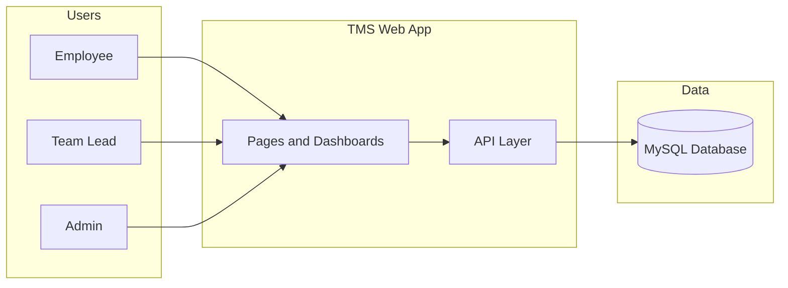
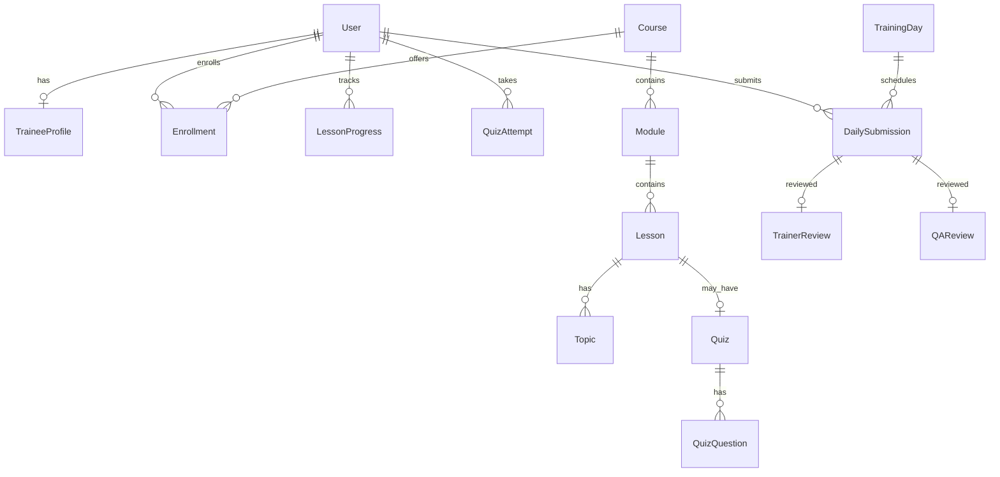
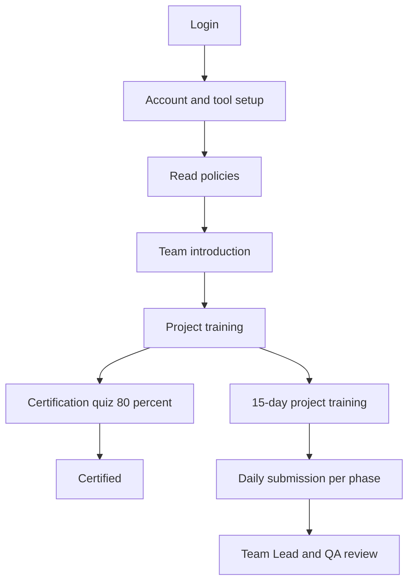

# TMS — Diagrams (3 required)

Export each block at [mermaid.live](https://mermaid.live) → PNG.

| # | Save as |
|---|---------|
| 1 | `TMS-01-System.png` |
| 2 | `TMS-02-Database.png` |
| 3 | `TMS-03-Flow.png` |

Attach with [DATABASE-DESIGN.md](./DATABASE-DESIGN.md) when sending to manager.

---

## 1. System overview

---

## 2. Database ERD

---

## 3. Onboarding flow

